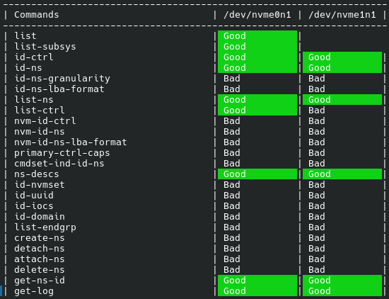

# NVMe-CLI Command Tester

NVMeCLI_cmdTest is a Python script that runs safe versions of all of the commadns listed on the NVMe-CLI Help page to verify which ones are available for use with your particular NVMe device. Since NVMe-CLI is a Linux-only command there will be no instructions for Windows.

## Installation

To install the script all you need to do is clone this repository. Do make sure you have both [Python](https://www.python.org/downloads/) and [`NVMe-CLI`](https://github.com/linux-nvme/nvme-cli) installed as well.

### Installing the Script
```bash
git clone https://github.com/Benjamin-Anderson-II/NVMeCLI_cmdTest/
```

### Installing Python
#### Debian-based
```bash
sudo apt get python3
```
#### Red Hat-based
```bash
sudo dnf install python3
```
#### Arch-based
```
sudo pacman -S python3
```
### Installing NVMe CLI
As made explicit in the NVMe-CLI [Readme](https://github.com/linux-nvme/nvme-cli) there is package manager support for most major distributions. Installation on the most popular of these is listed below

#### Debian-Based
```bash
sudo apt install nvme-cli
```

#### Red Hat-Based
```bash
sudo dnf install nvme-cli
```

#### Arch-Based
```bash
sudo pacman -S nvme-cli
```

## Usage

Running the script is as simple as calling the Python interpreter on the `NVMe_cmdTest.py` file.

```bash
# Navigate to the folder
cd NVMeCLI_cmdTest

# Run the Script
python3 NVMeCLI_cmdTest.py
```

## Reading the Output

In the output there are 2+ columns. The first column states the name of the command being tested, while all prceeding columns list the result begotten by the that specific device when the command was run on it. In the example below there are 3 columns. One for commmand names, and two for different devices being tested. When a column has no text, that is because that command is not "per-device." The `list` command is an example of this. The output of `nvme list` is a list of all NVMe devices found on the machine, and thus does not specify a specific device to run on. The `nvme id-ns` command however does operate on a specific device and as such has outputs in each device column. When a cell specifies "Good" that means the command can be run and does not error for any reason. When a cell specifies "Bad" that means that the command does not exist on that device. A clear example of this is `nvme list-ctrl` below. The first device (`/dev/nvme0n1`) has access to this command, hence "Good." The second device (`/dev/nvme1n1`) does not have access to this command, hence "Bad."



## Contributing

Pull requests are welcome. For major changes, please open an issue first
to discuss what you would like to change.
